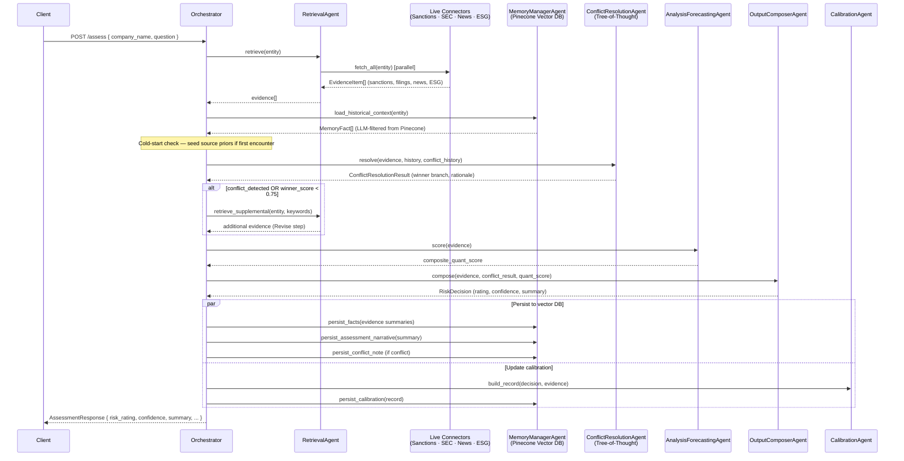

# Integrity Risk Assessment (IRA) Agent

A multi-agent FastAPI system that assesses company integrity risk using live data sources, LLM reasoning, and vector memory. Built Azure-native for App Service / Web App for Containers.

---

## Architecture Overview

The system uses a **hub-and-spoke orchestrator** pattern with 6 specialised agents. Each `POST /assess` request flows through the full pipeline:



---

## Agent Responsibilities

| Agent | Role |
|---|---|
| **OrchestratorAgent** | Coordinates the full pipeline; applies policy thresholds; triggers Revise step |
| **RetrievalAgent** | Fetches live evidence from all connectors in parallel; detects entity-not-found |
| **MemoryManagerAgent** | Reads/writes Pinecone vector DB; LLM-summarizes evidence; relevance-filters history |
| **ConflictResolutionAgent** | Tree-of-Thought beam search to resolve contradictory signals; sparsity dampener |
| **AnalysisForecastingAgent** | Scores evidence into a composite quantitative risk score |
| **OutputComposerAgent** | Converts scores into a human-readable risk decision with recommended next steps |
| **CalibrationAgent** | Tracks TP/FP/TN/FN per source; updates reliability scores over time |

---

## Live Data Connectors

| Connector | Source | Dimension |
|---|---|---|
| `OpenSanctionsConnector` | opensanctions.org | Sanctions |
| `SECConnector` | SEC EDGAR full-text search | Regulatory |
| `SECFinancialsConnector` | SEC EDGAR XBRL + filing dates | Financial |
| `NewsConnector` | NewsAPI | Reputational |
| `ESGConnector` | ESG rating provider | ESG |

Set `ENABLE_LIVE_CONNECTORS=true` to activate live API calls. Mock connectors are used by default.

---

## Vector DB Namespaces (Pinecone)

| Namespace | What is stored |
|---|---|
| `historical_facts` | LLM-summarized evidence items per entity per dimension |
| `assessment_narratives` | Full assessment summaries for semantic retrieval of similar past cases |
| `calibration` | Per-source reliability scores (TP/FP/TN/FN counters + Bayesian blend) |
| `conflict_notes` | Conflict resolution rationale for temporal coherence scoring |

---

## Run Locally

```powershell
pip install -r requirements.txt
Copy-Item .env.example .env
# Edit .env — set OPENROUTER_API_KEY, PINECONE_API_KEY at minimum
python run_local.py
```

The server starts on `http://localhost:8000`. API docs at `http://localhost:8000/docs`.

---

## Key Environment Variables

| Variable | Description |
|---|---|
| `LLM_PROVIDER` | `openrouter` (default) \| `openai` \| `azure_openai` \| `stub` |
| `OPENROUTER_API_KEY` | OpenRouter API key (used for both LLM and embeddings) |
| `LLM_MODEL` | LLM model name (default: `openai/gpt-4o-mini`) |
| `EMBEDDING_TYPE` | `openrouter` (default) \| `openai` \| `local` |
| `PINECONE_API_KEY` | Pinecone API key |
| `PINECONE_INDEX` | Pinecone index name (default: `ira-platform-memory`) |
| `ENABLE_LIVE_CONNECTORS` | `true` to call live APIs; `false` uses mocks (default) |
| `DB_BACKEND` | `sqlite` (default) \| `postgres` |
| `POSTGRES_DSN` | PostgreSQL connection string (when `DB_BACKEND=postgres`) |
| `SQLITE_DB_PATH` | SQLite file path (default: `./data/ira.db`) |
| `NEWS_API_KEY` | NewsAPI key for reputational signal connector |
| `OPENSANCTIONS_API_KEY` | OpenSanctions API key |
| `SEC_CONTACT_EMAIL` | Required User-Agent contact for SEC EDGAR requests |
| `ENABLE_API_KEY_AUTH` | `true` to require `X-API-Key` header |
| `ENABLE_JWT_AUTH` | `true` to require JWT bearer token |
| `APPLICATIONINSIGHTS_CONNECTION_STRING` | Optional — enables Azure Monitor telemetry |

---

## API Endpoints

| Method | Path | Description |
|---|---|---|
| `GET` | `/health` | Liveness check |
| `GET` | `/ready` | Readiness check (probes DB + vector store) |
| `POST` | `/assess` | Synchronous company assessment |
| `POST` | `/assess/async` | Queue an assessment job |
| `GET` | `/tasks/{task_id}` | Poll async job status and result |
| `POST` | `/watchlist` | Add entity to monitoring watchlist |
| `GET` | `/watchlist` | List all watchlist entities |
| `GET` | `/watchlist/{entity_id}` | Get cached assessment (`?refresh=true` to re-assess) |
| `GET` | `/assessments/{entity_id}` | Assessment history for an entity |

---

## Observability

- **Always on:** Structured JSON logging (`LOG_FORMAT=json`) at every pipeline stage
- **Azure Monitor:** Set `APPLICATIONINSIGHTS_CONNECTION_STRING` to stream traces to App Insights via OpenTelemetry — optional, graceful no-op if unset
- **Request metrics:** `MetricsMiddleware` logs method, path, status code, and duration for every request
- **Assessment telemetry:** Each response includes a `model_metadata.telemetry` block with risk rating, confidence score, evidence count, conflict detection flag, and quant scores

---

## Azure Deployment

```
GitHub Actions → Azure Container Registry → Azure App Service
```

Workflow file: `.github/workflows/ci-cd.yml`

Required GitHub secrets/variables:
- `vars.AZURE_WEBAPP_NAME`
- `vars.AZURE_RESOURCE_GROUP`
- `vars.AZURE_CONTAINER_REGISTRY`
- `secrets.AZURE_CREDENTIALS`

### Background Workers

| Script | Trigger | Purpose |
|---|---|---|
| `webjobs/continuous/run.py` | Azure Storage Queue | Drains async assessment jobs |
| `webjobs/scheduled/run.py` | Cron schedule | Re-assesses all watchlist entities |

---

## Running Tests

```powershell
python -m pytest tests/ -q
```

73 tests covering agents, connectors, conflict resolution, calibration, cold-start, and scoring consistency.
